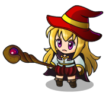
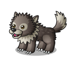
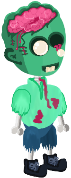
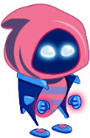
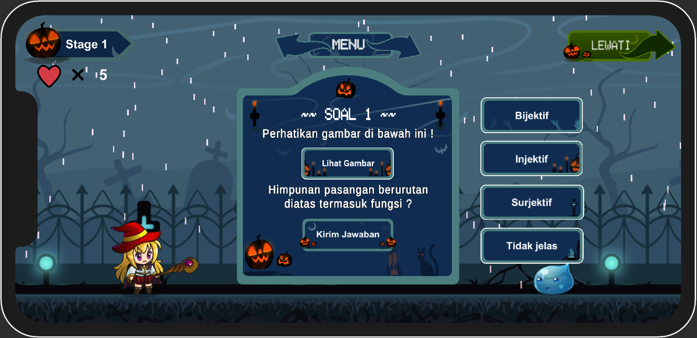
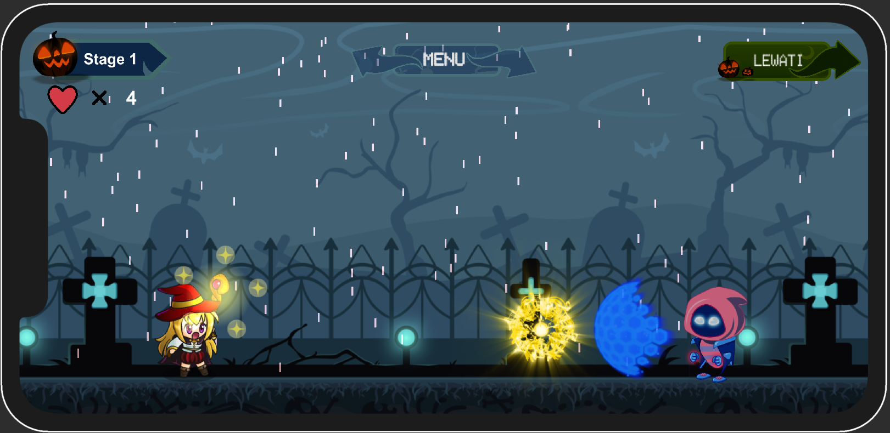
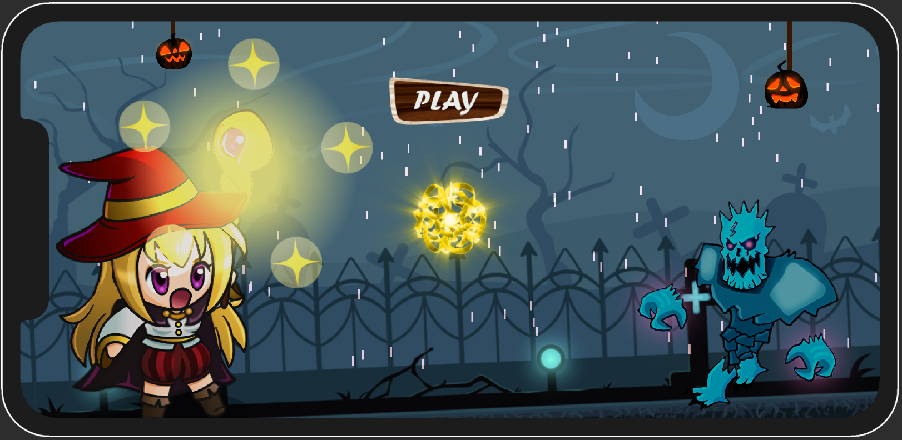

✨ ~ Math Wizard Educational Game ~ ✨
-

✨ 👋 Hi Everyone 👋 ✨

So in this time I want to share another project with you, previously I shared a project about the Laravel website, now we are looking for something different, now I want to share a project about games. The game project that I will share has a theme about learning mathematics, there are 3 stages in this game.

There are several types of characters in this game, as can be seen below :

<table width="100%" border=0 align="center">
    <tr>
        <td align="center" colspan=3>
        ~~ Character Preview ~~
        </td>
    </tr>
    <tr align="center" valign="middle">
        <td>
            Image
        </td>
        <td>
            Type
        </td>
        <td>
            Link Source
        </td>
    </tr>
    <tr align="center">
        <td>
            
        </td>
        <td>
            Main Character (player)
        </td>
        <td>
            <a href="https://pipoya.itch.io/pipoya-free-2d-game-character-sprites">Pipoya 2020</a>
        </td>
    </tr>
    <tr align="center">
        <td>
            
        </td>
        <td>
            Slime (enemy)
        </td>
        <td>
            <a href="https://pipoya.itch.io/pipoya-free-2d-game-character-sprites">Pipoya 2020</a>
        </td>
    </tr>
    <tr align="center">
        <td>
            
        </td>
        <td>
            Wolf (enemy)
        </td>
        <td>
            <a href="https://pipoya.itch.io/pipoya-free-2d-game-character-sprites">Pipoya 2020</a>
        </td>
    </tr>
    <tr align="center">
        <td>
            
        </td>
        <td>
            Zombie (enemy)
        </td>
        <td>
            <a href="https://marwamj.itch.io/2d-game-zombie-character">Marwa MJ (2017)</a>
        </td>
    </tr>
    <tr align="center">
        <td>
            
        </td>
        <td>
            Ghost (enemy)
        </td>
        <td>
            <a href="https://marwamj.itch.io/2d-free-game-character">Marwa MJ (2017) </a>
        </td>
    </tr>
    <tr align="center">
        <td>
            
        </td>
        <td>
            Monster (enemy)
        </td>
        <td>
            <a href="https://marwamj.itch.io/2d-monster-character">Marwa MJ (2017) </a>
        </td>
    </tr>
</table>

---
 
Now you can see a preview of what the game project will look like ...
 
 
<table width="100%" border=0>
    <tr>
        <td align="center" colspan=3>
        ~~ Gameplay Preview ~~
        </td>
    </tr>
    <tr align="center" >
        <td>
             
                
             
        </td>
        <td>
             
                
             
        </td>
    </tr>
    <tr align="center" >
        <td colspan=2>
             
                
             
        </td>
    </tr>
</table>

Note :
-

I made this project using the <b>Unity3d Free license software.</b> You can run this project with <b>Unity Editor version "2021.3.23f1".</b> If you use a version that is above it, it should be fine, but I recommend using the same version to avoid conflicts or errors. But if you want to try a different version that's fine.
Good luck... ✨✌

If you want to try the game first before opening the project, you can download the game.apk file in the "Demo_App" folder that I have provided.

✨ You can use other people's work to learn but you cannot claim other people's work ✨  I hope this project can help you, see you next time... ✨✌

 

Special Thanks :
-
My special thanks go to "<b>Pipoya (2020)</b>" & "<b>Marwa MJ (2017)</b>" who have provided free image assets on their website and also thank the "<b>pixabay.com</b>" page which has provided various very useful sound access for free. We don't forget to thank the various parties who have helped in the process of making this educational game. 🙏

 
#Unity3d #Education #Game #C#
